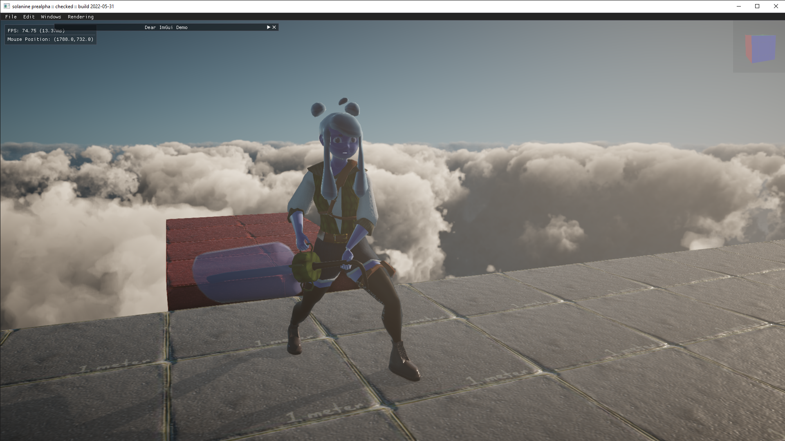

# DemoEngine

It's just currently a dumping ground for proof-of-concept and following opengl tutorials for the time being. However, in the future we want to make this the foundation for a game engine. Maybe, once ray tracing becomes very relevant, we can port this thing over to vulkan and take advantage of those crisp shadows and oooo so juicy GI! I guess the reflections are flaunted too eh.

*A Screenshot*

# Roadmap
*NOTE: this is only Timothy's ideas here in this Roadmap section.*

I have the goal of making this a very suitable framework for making games by the time I graduate (December 12th, 2021). From there, I will use it to make a game, and from the extending I do from this base framework, I may contribute them back in or if it isn't abstract enough, I may just leave as a forked version for the style of game that I made.

As for this pre-graduating timeline, here are the features I would like to implement:

- Entity Management (no hierarchy pleeeeaaasseee!!! It's too slow! Just flat with some organizational folders/filters!)
- Advanced Rendering
- Basic Physics
- Hot-swappable shader creation
- Fast, hot-swappable models
- Programmer-friendly engine extension
- Audio
- In-scene physics simulation
- Solid industry-standard render passes
- *FUTURE:* Reflections and probes and whatnot

Of course, this isn't a game engine when you have all of these things, but it's a good framework where you build your game *in*, as opposed to the approach of a game engine where it's a standalone program that you build your game *on*. Compilation would be very long when changing "engine code", but hopefully this just means that once the code matures and fits all the requirements needed at hand, then it will be everything that's needed. *At that very point* is when it needs to become a game engine. But then if random ppl use it then they'll want more features and I'll have to raise my middle finger at them and say no!

Yeah, so essentially if you wanna use this to make a big open world game, or one that has small discrete levels, then just change the engine to do discrete, fast, individual level loading or level streaming! It's up to you. And hopefully this framework will provide just enough boilerplate code to make that happen... easily.

## Entity Management

Pretty much like the unity/unreal hierarchy but not as bog slow.

NOTE: Once you get done with this, then implement ImGuizmo!

## Advanced Rendering

StackEdit stores your files in your browser, which means all your files are automatically saved locally and are accessible **offline!**

## Basic Physics

For this timeline, I would like to simply have physics objects be able to be implemented using Nvidia Physx version 4.

## Hot-swappable shader creation

Due to the need to write shaders and make it easy and quick, having this be hot-swappable is important.
Making a fallback layer for the shaders would be important too, when there is a shader error. Perhaps a bright purple fragment shader would be good, but there would *need to be a unified, basic vertex shader that can support both regular models and skinned models*, along with an easy shadow render pass.

## Hot-swappable models

This is important too. And make it 10x faster than Unity and 20x faster than Unreal.

## Programmer-friendly framework extension

Simply having the "engine" be light would be good, and to keep in mind that rather than thinking of this as an engine, a framework would be better.

## Audio

Unfortunately, audio isn't my strong suit, so basic mixing functionality here and then extend it later for an actual audio expert in on this situation.

## In-scene physics simulation

The most annoying part of Unity is doing a physics simulation to place things like fallen trees on the ground, and Unity doesn't let you save the positions and euler angles... so sad! So we're not gonna do that.

## Solid industry-standard render passes

I don't know how easy they'll be to implement, but there are generally these render passes in order:

- Skybox
- Geometry
- Pre-transparent
- Transparent
- Post-processing

Having lots of control over this (especially to implement things that **need** an in-between pass like drop shadows (put in between pre-transparent and geometry!!! But after the depth buffer is re-written and skinned models updated)) is very important.

## Reflections and probes and whatnot

Eeeehh, it's for the future.