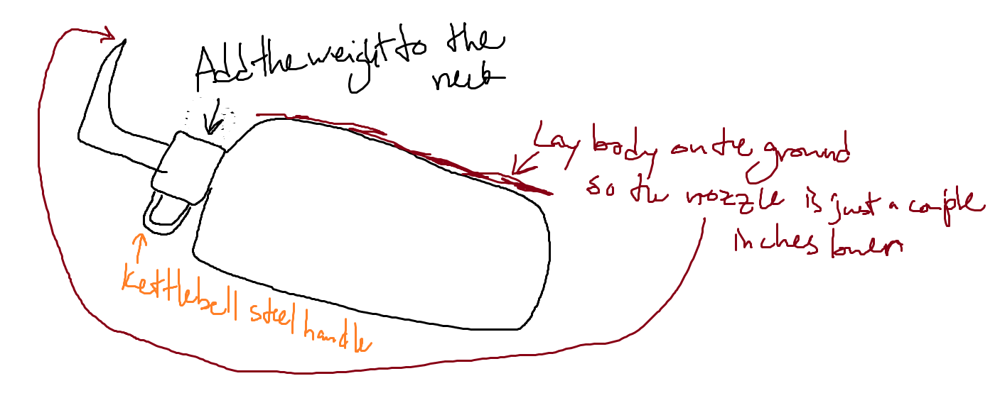

# Gameplay > Bottle Wielding

- Design of the bottle is like a kettlebell handle.
- A lot of combos should start with getting into position with some kind of kettlebell exercise
    - EX: have a kettlebell swing to put the bottle out in front of you so that you can do a horizontal swing (right to left)
    - The default MUGAMAE also requires a swing backwards and a sink in stance to prep for an upwards swing

---

## Ideas

- If the bottle floated on your back like jrpg tropes... maybe have that bc it's magical but when you will it into your hands it's actually like super duper heavy?
- Whether or not that happens, the bottle should be heavy.