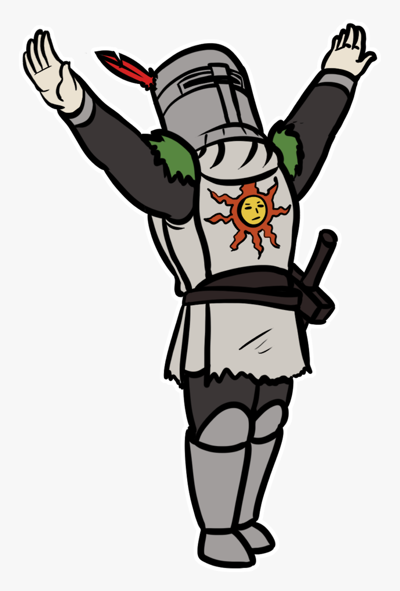

# World > Functions

## Writing in the Journal (saving)

Jojo will pull out a very short pencil and his journal and write down the current date, time, and situation. This will be saving bc if Jojo faints, Anokata will save him and bring him back to the very moment in time and space where Jojo wrote in his journal. Jojo will awake right in the squatting position where he was (whichever save the player chooses to come back to).

NOTE: Jojo's face will be a little surprised, and the transfer from dead body/soul form to entering back into life should have some very cool effects.

## Willing yourself to the weapon

Here is a description of the camerawork:

- The weapon is midair, getting hurled at super high speeds
- Player lifts chest and face upwards, with a praise the sun pose (but hands a bit lower)
    - 
- Player falls forward as their body disintegrates like "willing the weapon into the player's hands"
- Camera points towards the bottle and starts accelerating towards it
- Camera keeps speeding up, screen starts to shake, fov starts to increase, chromatic abberation ensues, CCW dutch angle slowly starts to form, a "headache"-like sound with loud wind rushing sound fades in and gets louder as the speed builds up.
- Camera slaps right into the position where the weapon's at, and a loud boom sounds, and the chrom abber and dutch and fov return back to normal.
- Player appears there with the disintegration color as particles explode out.
    - AKA, normally the un-disintegration happens at the same time as the disintegration (like willing the weapon into the hands of the player), but since you really don't see it until you get there, it's like an explosion when your "spirit" gets there.
    - NOTE: in the animation, the body does actually render over where the bottle's at (un-disintegrates at the same time as the disintegration).
